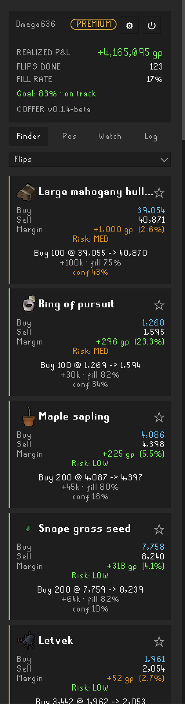
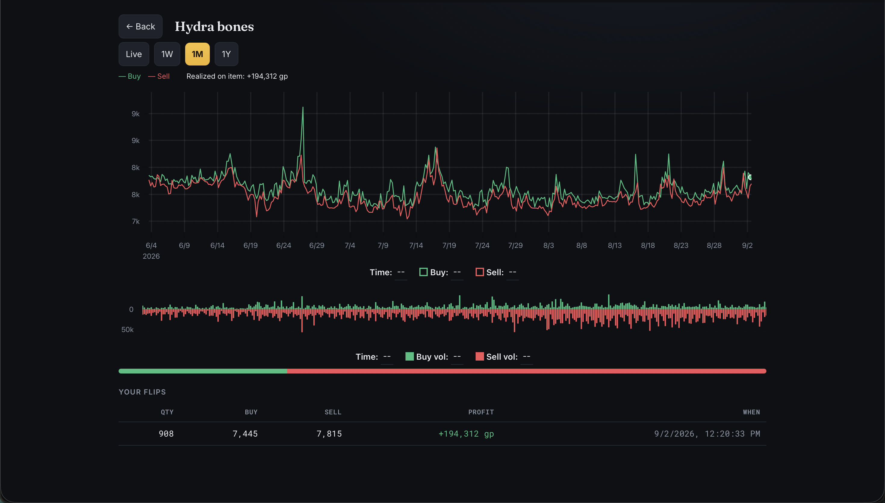

# Coffer — a Grand Exchange flipping copilot

Stop guessing what to flip. Coffer ranks live GE opportunities by real fillable prices, plans your
slots, and coaches every open offer — when to hold, reprice, cut, or average down — while tracking
your profit automatically. It's the merching assistant that sits in your RuneLite side panel and
tells you what to do next.

## What it does

- **Ranked flip finder** — opportunities scored on 1-hour fillable prices (not the fake instant
  spread), gated against falling knives and low-volume traps.
- **Per-slot plan** — a concrete buy list sized to your bankroll and free GE slots.
- **Position coaching** — every open offer gets a verdict: **HOLD / REPRICE / CUT**, with a target
  price and a confidence level. Underwater? It suggests an **average-down** to recover.
- **Automatic P&L** — completed flips logged and totalled (moving-average cost), with a full trade
  log. Missed fills while you were offline? It reconciles them from your in-game GE History.
- **Watchlist, high-alch & crash finders** — star items to track; spot alch margins and price crashes.
- **Anti-crowd warnings** — see when everyone's piling into the same item so you don't join the herd.

Premium adds crowd fill-rate + backtested confidence on picks, off-client **Discord alerts**, and a
**web dashboard** with an interactive price chart and your positions.

## Getting started

1. Install **Coffer** from the Plugin Hub and enable it.
2. Open the Coffer side panel → **Create account** (free, takes a few seconds — same username/password
   fields, no email).
3. Set your bankroll and GE slots, and start flipping. Coffer does the rest.

## Tiers

- **Free** — F2P flip suggestions.
- **Standard** — full members tool: plan, positions + coaching, watchlist, alch/crash, P&L + log.
- **Premium** — crowd fill-rate + backtested confidence, Discord alerts, and the web dashboard.

## Privacy — what it sends

Coffer is a client for the Coffer service and requires a (free) account; it shows nothing until you
sign in. To provide suggestions and P&L it sends the following to the Coffer server
(`https://ge-copilot.onrender.com`) over HTTPS, and nothing else:

- Your login, to obtain a session token. Your **password is never stored on disk** — only a session
  token, kept locally under `.runelite/coffer/session`.
- Your current GE offers and completed trades (item, side, price, quantity, time), used for your P&L
  and to improve cross-account fill-rate suggestions.

The server is a third party not controlled or verified by the RuneLite developers. The server URL is
fixed; there's nothing to configure beyond the in-panel login and a few flip preferences. There's no
self-serve password reset yet — contact the owner if you lose your password.

## Missed trades (GE History import)

Coffer records fills live while it's running. If some complete while the client is closed, open the
in-game **Grand Exchange → History**: Coffer reads it, finds trades it didn't record, and offers to
import them so your P&L stays accurate. It never opens History on its own — you open it, a panel
prompt does the rest.

## Building

Standard RuneLite plugin. `./gradlew build` produces the plugin jar; `./gradlew runClient` boots a
developer RuneLite with Coffer loaded (requires a Jagex session).

## License

BSD 2-Clause — see `LICENSE`.
